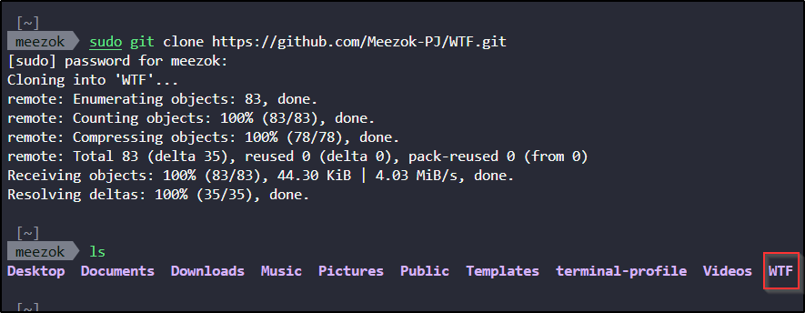
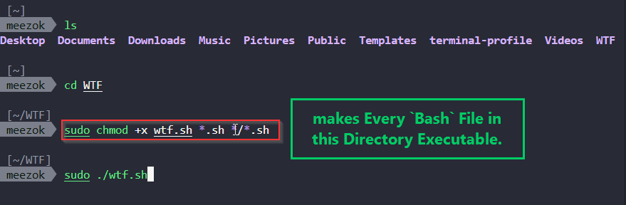

### ⚔️ WTF Wrapper Tactical Framework

## 📖 Overview

**WTF (Wrapper Tactical Framework)** is a modular, Bash-based launcher designed to make penetration testers to be more **productive, user-friendly, and efficient**.

Instead of juggling long one-liner scripts and environment setups, WTF **wraps around tactical tools** and presents them in a clean, interactive way.

💡 **Why did i created this framework:**
>Have you ever gotten tired of typing long, complicated commands just to use a tool or Better output?.As a I sail in my cybersecurity journey , I found myself getting frustrated with repetitive setups. So, I built WTF as a simple, Bash-based launcher to make our lives easier.Think of it as a friendly, interactive framework that takes powerful tools and makes them more accessible. It’s designed to boost your efficiency and productivity, whether you’re a pro streamlining your workflow or a beginner taking on your first CTF challenge.WTF is a Framework that’s growing with me on my pentesting journey. It’s a work in progress, and I’m always adding new features and improvements.The **framework** was meant to be Personal usage to assist me in **CTFs and penetration testing simulations**,But one of my Colegue insisted me To share it.I am still in the **learning phase of penetration testing** and not yet a professional in the field, so this project is a **work in progress**. Some features may change or be removed as I gain more knowledge, and better features will be added along the way. This is both a **tool for practice** and a **concept I am continuously improving** as I grow in cybersecurity.

***

## 🔑 Features: CLICK-ON Links to view Usage/Documentation

* 🧩 **Modular Bash Launcher**: one framework, multiple tools.

* [⚡ **RustScan Wrapper**: requires knowledge of RustScan + Nmap flags and Switches.](docs/WTF-README.md)

* 🔍 **MPSA (Meezok Pentester Search Assistant)** : advanced file/wordlist search (regex, wildcards).

* 🐳 [**AutomatedKali-Light Sandbox** : lightweight Dockerized Kali for tool testing.](docs/Automated-kali-Docker-V2.md)

* 📜 **Unified Logging** : JSON lines written to `logs/`, easy to parse.

---
## ⚙️ Installation

### Requirements

* **Linux / macOS**

* **Bash or Zsh**

* **Docker** (for RustScan, MPSA, Kali sandbox)

### Setup

```bash
# Clone repo
git clone https://github.com/Meezok-PJ/WTF.git
cd WTF

# Make scripts executable
chmod +x wtf.sh *.sh */*.sh

# Run launcher
./wtf.sh
```

***

## 🕹️ Usage

### Quickstart

```bash
cd ~/WTF
./wtf.sh
```

---

### Logs

* Central log → `logs/wtf.log` (JSON, machine-parsable)

* Per-tool logs → `logs/rustscan.log`, `logs/mpsa.log`, `logs/kali.log`

### Example: RustScan Wrapper

```bash
./rustscan_wrapper.sh -a 192.168.1.1 -- -sV
```

### Example: MPSA (Regex Search)

```bash
python3 mpsa/mpsa.py --search "*.conf" --regex "password"
```

### Example: Kali Sandbox

```bash
./kali_manager.sh start
./kali_manager.sh stop
```

***

## ⚙️ Configuration

* By default, MPSA will attempt to **mount host SecLists/wordlists** if present (read-only).

* The sandbox creates a `$HOME/kali_sandbox/README.md` with manual usage notes.

* All logs are JSON-structured for easier integration with **SIEM/ELK/Grafana**.

***

## 🤝 Contributing

Contributions are welcome! Since this framework is also part of my **learning journey in penetration testing**, I’m open to feedback, corrections, and suggestions.

* Inspired by real-world pentesting frustrations and CTF practice 🕵️‍♂️

***
## 🙌 Special Thanks and Credits To:

I would like to give a huge **thank you** to the developers and communities behind:

* 🐳 **[Docker](https://www.docker.com/)** : for making containerization simple, fast, and reliable.

* 📂 **[SecLists](https://github.com/danielmiessler/SecLists)** : for providing an incredible resource of wordlists that power countless security projects.

* ⚡ **[RustScan](https://github.com/RustScan/RustScan)** : for building one of the fastest and most efficient port scanners out there.

* Thanks to their amazing work, **WTF (Wrapper Tactical Framework)** became a true **powerhouse for productivity and efficiency** in pentesting simulations and CTF practice. 🚀

***

## ⚠️ Limitations

* 🔍 **MPSA Module Search (Metasploit)** → The feature for searching directly within Metasploit modules is **not yet functional**.

* 🐳 **Docker dependency** → All containerized components (RustScan, MPSA, Kali Sandbox) require Docker to be installed and running.

* 🔄 **Learning Project** → As this framework evolves with my pentesting journey, some features may change, be removed, or replaced with better implementations.
