## 👨‍💻 Automated Lightweight Kali Sandbox inside WTF
---
* Let’s get straight to it. This tool is your personal, Script testing Kali sandbox, now Integrated directly into the **WTF (Wrapper Tactical Framework)**. It's a lightweight, isolated environment that lets you test whatever you want malicious scripts, custom tools, or anything from GitHub  without trashing your host system or messing up your VM's dependencies.

* Forget clunky `docker` commands and manual installs. This sandbox is **menu-driven** and **user-friendly**, meaning once you exit the container shell, you're dropped right back into the menu. This makes management a breeze, letting you focus on the fun stuff.


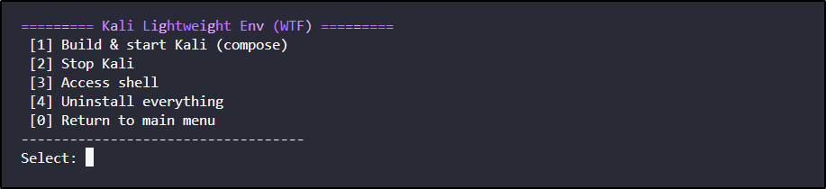  

***

### Key Features

* **Rapid Deployment:** Go from zero to a fully functional Kali environment in seconds with Docker Compose.
* **Host System Protection:** The container is truly isolated, so a buggy script or a malicious tool will not affect your host operating system.
* **Persistent Storage:** A dedicated volume ensures all your work, scripts, and data are saved and available even after the container is shut down and restarted.
* **Pre-installed Toolset:** The Dockerfile includes essential tools like `nmap`, `curl`, and `git`, saving you from repetitive manual installations.
* **Portability:** The `Dockerfile` and `docker-compose.yml` ensure the exact same environment can be recreated on any machine with Docker installed.

***

### Project Philosophy

For a deeper dive into the original project's architecture and design philosophy, check out the **[Automated Kali Docker Project](test)**. This is the foundation upon which the new, upgraded WTF tool was built.

>I built this tool out of sheer necessity. I was testing an OSINT framework one day, and it started installing a ridiculous number of dependencies and extra tools. I watched it create strange shortcuts and files all over my virtual machine. That's when it hit me: why not create a safe environment to run these tools? A place where they could install whatever they wanted without affecting my system's package dependencies or leaving digital clutter behind. This project is the result of that frustration — a clean, contained space where you can test to your heart's content, no cleanup required.

Now let’s create a scenario use case: testing **my own framework project**. First we build the Docker image, then access it, then `git clone` our repo, and finally run the tool 👍 (treating my script as a malicious GitHub script 🏴‍☠️).

---

### Use Case: Testing a GitHub Project 🏴‍☠️

This sandbox is the perfect place to safely test and evaluate tools you find online, especially those with a lot of dependencies. Let's walk through an example. We will test my own framework (**WTF**) as an example.

1. **Start the Sandbox:** From the main WTF menu we select option \[3] to access the Kali Sandbox menu options, then choose `[1] Build & start Kali (compose)`.

***

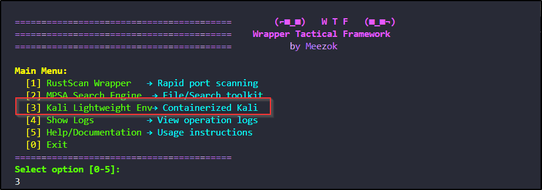  

***

* **As you can see the project/tool will be saved in the home directory path for easy access later**
***

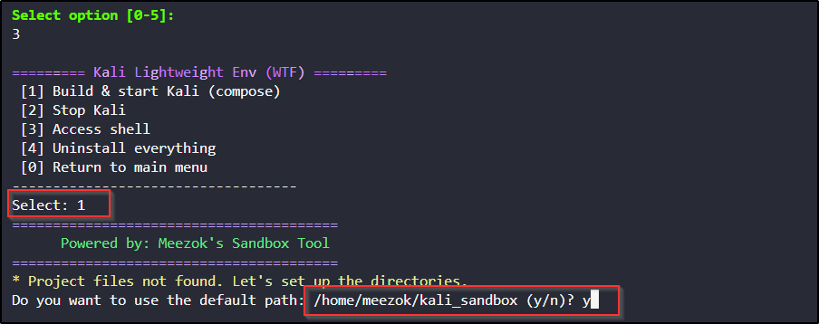  

***
* **After starting Docker, the project is built in the specified directory with persistent storage, Dockerfile/yaml, and README**

***

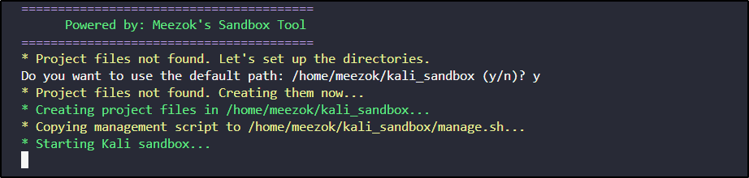  

----

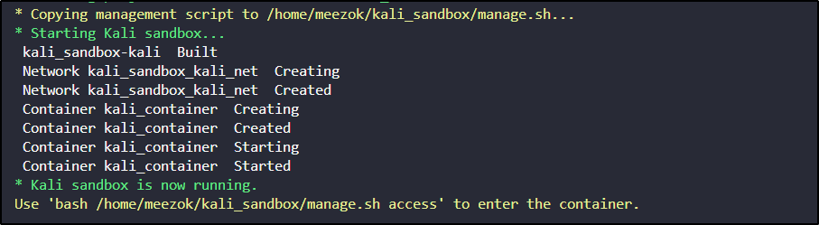  

***

* `[Output]` The Docker image is built and the container is started. The script confirms the persistent volume is created and ready.

3. **Access the Shell:** From the Kali menu, we select `[3] Access shell`.
***
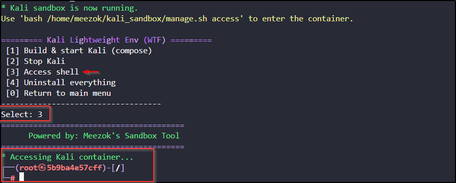  
***
* `[Output]` The terminal drops us into the isolated Kali environment. We are now inside the sandbox, ready to get to work. Type `exit` to return to the Kali menu.

 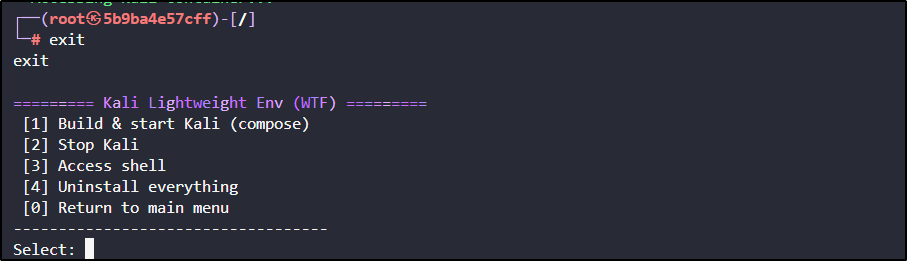  

- Clone my tool to test a real-world scenario (like testing a random script you found on GitHub).

---

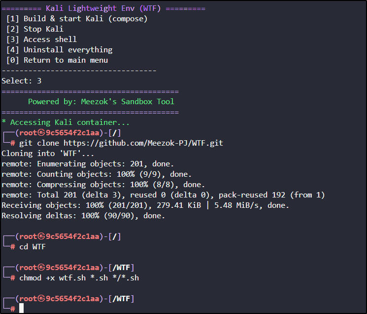  

---

As you can see in the screenshot, you can debug a tool and watch how it behaves. In this example, a missing package (`bc`) .

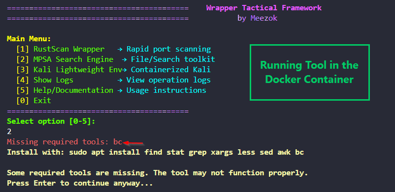  

---

5. **We navigate to the `/mnt` directory (our persistent volume)** this is connected to `~/sandbox` on the host. Use `/mnt` if you want to move files/folders from container → host machine.

- create a file then copy it to the Presistant Volume`/mnt`
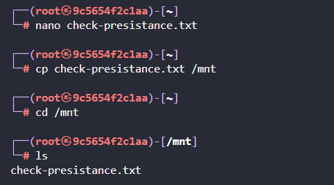
- exit from container by typing `exit`  then press `Enter`.
***
- lets check what files my Automated Creates
**`cd ~/sandox`**: this is the Mounted Volume where u can see Files u Copied.
**`cd ~/kali_sandbox`**: main folder contains Dockerfile + docker-compose u can edit the container setting how ever u want.Also u can execute `manage.sh` that Enters manual mode of Accessing Container(old version of my Project)

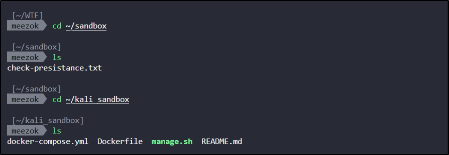

* The manual Mode:
* *Tip: use an alias to easily access container.*
```bash
 [~/kali_sandbox]
 meezok  sudo ./manage.sh                   
[sudo] password for meezok: 
========================================
      Powered by: Meezok's Sandbox Tool
========================================
========================================
      Powered by: Meezok's Sandbox Tool
========================================
Usage: bash ./manage.sh [command]

Commands:
  start     - Builds and starts the Kali sandbox container.
  stop      - Stops and removes the sandbox container and network.
  access    - Enters the running container's bash shell.
  uninstall - Removes all project files, containers, and persistent data.
  help      - Displays this help message.

Configuration:
  You can override the default directories by setting these environment variables:
  KALI_SANDBOX_DIR=  (default: )
  KALI_SANDBOX_DATA_DIR= (default: )

Additional Commands:
  * Manual container access: sudo docker exec -it kali_container bash
````

* Lastly there is `README.md` if u want read about the **Project** and some **Tips**.\
  

***
