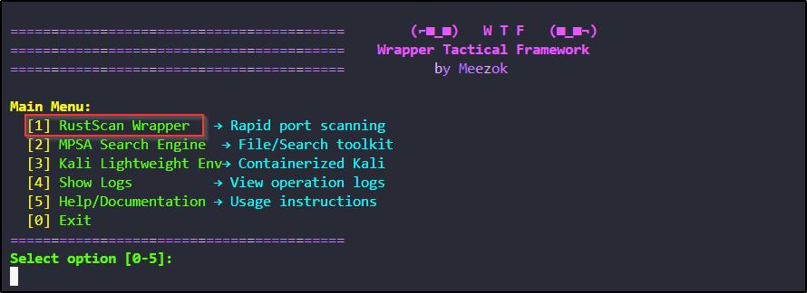
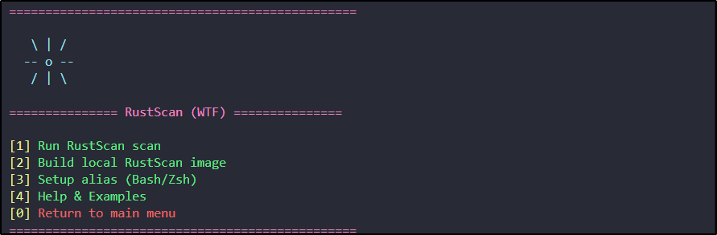
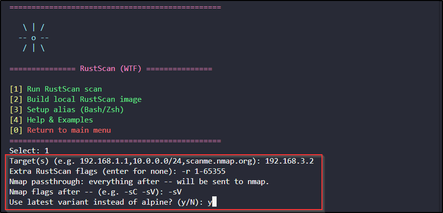
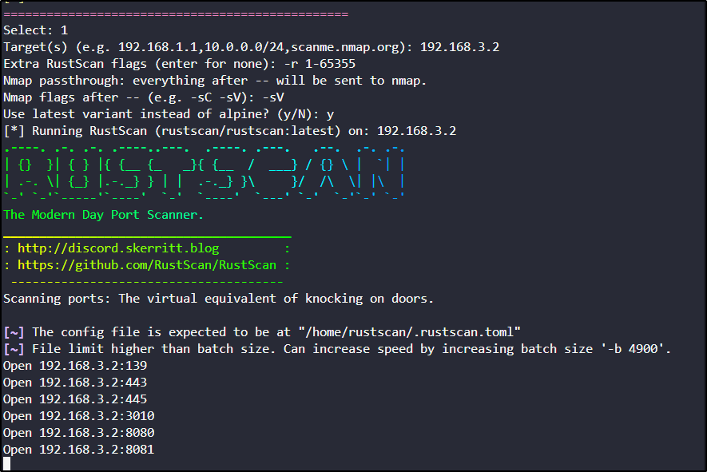
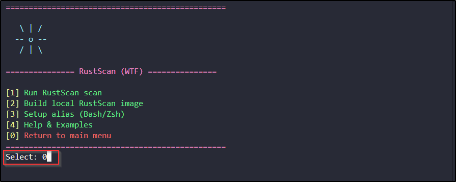
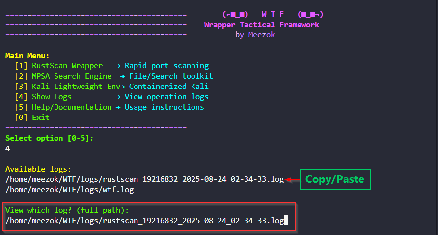
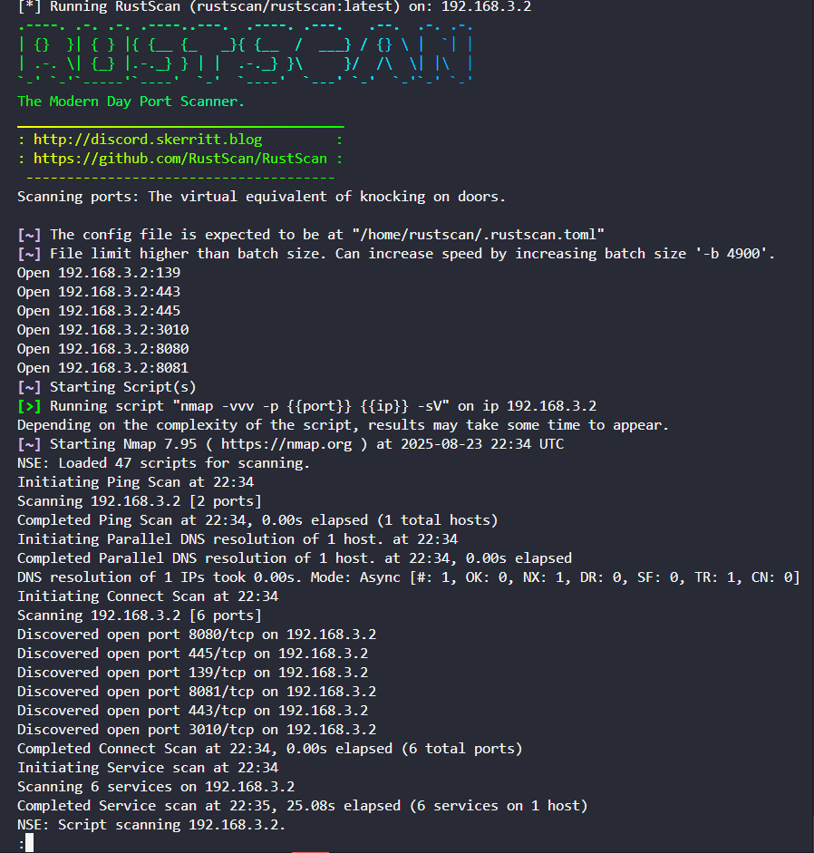

### 👁️ User-Friendly RustScan Tool Usage

#### RustScan Module

* Designed to boost your efficiency, the RustScan module wraps the RustScan Docker image in a simple, user-friendly TUI (Terminal User Interface). A foundational knowledge of RustScan and Nmap flags will help you get the most out of the tool. Refer to this menu for a quick and comprehensive guide.

### ⚠️ Important Setup Note

* If you are running `./wtf.sh` with `sudo` for the very first time, it is highly recommended to use option **\[2] Build Local RustScan Image** first. This will ensure all permissions are correctly configured and that the local Docker image is available for subsequent scans.

***

### Usage Guide

This is a step-by-step guide on how to run a scan using the RustScan module within the WTF framework.

1. **Launch the Framework and Select the RustScan Option**

   Begin by running the main `wtf.sh` script. From the main menu, type `1` and press `Enter` to access the RustScan Wrapper.



3. **Input Scan Parameters**

   The tool will guide you through the required inputs for your scan in a user-friendly, interactive way. You'll be prompted to provide Four key parameters:

   * **Target(s):** The IP address, CIDR range, or hostname you want to scan.

   * **Extra RustScan flags:** Any additional flags for RustScan itself (e.g., `-t 500` for a faster timeout).

   * **Nmap flags:** Flags to be passed through to Nmap for more detailed analysis (e.g., `-sC -sV` for default script and version detection).
----
  
----
   * Once you have entered your parameters, the tool will ask if you want to use the latest image variant. Type `y` and press `Enter` to confirm, or just press `Enter` to use the default. Finally, press `Enter` one more time to run the scan.
---
   
---
4. **Review and Access the Scan Log**

   * **Logging and Post-Scan Review**

  After the scan is complete, the output is automatically saved to a log file in the `logs/` directory. The log file follows the format: `rustscan_ip_date_time-24format.log`. For example: `rustscan_19216832_2025-08-24_02-34-33.log`.
  * Return Back to the WTF menu by choosing option `0`
---

---
  * **View Scan Results**

  To view the scan results, you can use the `4` option in the menu. The tool will prompt you for the full path of the log file you wish to view. For easy access, you can copy the full log path (e.g., `/home/meezok/WTF/logs/rustscan_19216832_2025-08-24_02-34-33.log`) using `Ctrl+Shift+C` and paste it into the input field with `Ctrl+Shift+V`.

---

---
* Result of rust scan inside the Log press `q` to quit :
---

---

***

### Core Features

#### **\[1] Run RustScan Scan**

This option initiates the RustScan wrapper's **Terminal User Interface (TUI)**. It guides you through a seamless and interactive process for running scans. A foundational knowledge of RustScan and Nmap flags will help you get the most out of this feature.

#### **\[2] Build Local RustScan Image**

This feature allows you to build a customized, local Docker image for RustScan. It's ideal for users who need to add specific tools or dependencies, or simply prefer to have a local version ready to go. The process automates the Docker build command using the `Dockerfile.rustscan` file, ensuring a seamless and repeatable setup.

#### **\[3] Setup Alias (Bash/Zsh)**

To simplify your workflow, this feature automatically creates a convenient alias for the RustScan Docker command in your `.bashrc` or `.zshrc` file. Once the alias is set up, you can run RustScan directly from your terminal as if it were natively installed, without having to type the long `docker run` command. After selecting this option, you must run `source ~/.bashrc` or `source ~/.zshrc` to apply the changes to your current terminal session.


3\. Review and Access the Scan Log

After the scan is complete, the output will be automatically saved to a log file in the logs/ directory. You can easily access this log file, which is named based on the target and timestamp, directly from the main wtf.sh menu.

## **Option [4] help menu** 

```bash
-------------------------------------------------------------+
|              Nmap & RustScan Cheat Sheet                    |
+-------------------------------------------------------------+
|                    RustScan - The Modern Port Scanner       |
+-------------------------------------------------------------+
| Flag/Switch          | Description                          |
+----------------------+--------------------------------------+
| -a <target>          | Target IP address or CIDR range.     |
|                      | Example: 192.168.1.1 or 10.10.10.0/24|
+----------------------+--------------------------------------+
| -p <ports>           | Scan specified ports.                |
|                      | Example: -p 80,443                   |
+----------------------+--------------------------------------+
| -r <range>           | Scan a port range.                   |
|                      | Example: 1-1000                      |
+----------------------+--------------------------------------+
| --top <num>          | Scan the top N ports.                |
|                      | Example: --top 100                   |
+----------------------+--------------------------------------+
| -b <num>             | Set batch size for scanning.         |
|                      | Example: -b 1500                     |
+----------------------+--------------------------------------+
| -t <num>             | Set timeout in milliseconds.         |
|                      | Example: -t 500                      |
+----------------------+--------------------------------------+
|                        Nmap - Network Mapper                |
+-------------------------------------------------------------+
| Flag/Switch          | Description                          |
+----------------------+--------------------------------------+
| -sS                  | TCP SYN scan (stealth scan).         |
+----------------------+--------------------------------------+
| -sT                  | TCP Connect scan (full handshake).   |
+----------------------+--------------------------------------+
| -sU                  | UDP scan.                            |
+----------------------+--------------------------------------+
| -p <ports>           | Scan specified ports (e.g., -p 80,443).|
+----------------------+--------------------------------------+
| -p-                  | Scan all 65535 ports.                |
+----------------------+--------------------------------------+
| -F                   | Fast scan (top 100 ports).           |
+----------------------+--------------------------------------+
| -A                   | Aggressive scan (OS detection,       |
|                      | version detection, script scanning). |
+----------------------+--------------------------------------+
| -sV                  | Version detection.                   |
+----------------------+--------------------------------------+
| -O                   | OS detection.                        |
+----------------------+--------------------------------------+
| -T<0-5>              | Set scan timing (0=slow, 5=fast).    |
+----------------------+--------------------------------------+
| -Pn                  | Treat all hosts as online (skip ping).|
+----------------------+--------------------------------------+
| -oN <file>           | Output to normal format.             |
+----------------------+--------------------------------------+
| -oX <file>           | Output to XML format.                |
+----------------------+--------------------------------------+
| -iL <file>           | Scan targets from a file.            |
+----------------------+--------------------------------------+
| -v                   | Increase verbosity.                  |
+----------------------+--------------------------------------+
| --script=<script>    | Run a specific Nmap script.          |
+----------------------+--------------------------------------+
| -sC                  | Equivalent to --script=default.      |
+----------------------+--------------------------------------+

```
